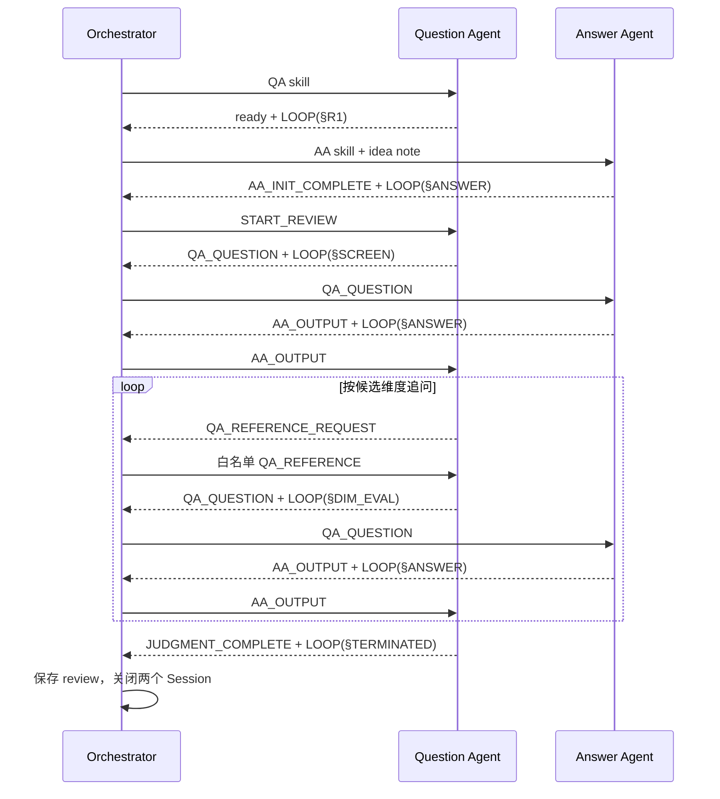

# 把 Claude Code Skill 写成可执行伪代码：双 Agent 论文盲评工作流实战

大模型很擅长完成单次任务，但当任务变成多轮协作后，问题很快会从“模型会不会回答”变成：

- 它还记得自己执行到哪一步吗？
- 它是在继续追问，还是应该结束并给出结论？
- 两个 Agent 会不会看到不该看到的信息？
- 模型输出了一大段分析，但调度脚本怎么知道该把什么转发给谁？
- 运行到一半失败后，能否从已有结果恢复，而不是从头重新花一次钱？

在 `/data3/paper_analysis` 中，我用 Claude Code 的 skill 和一个 TypeScript 编排器实现了一套双 Agent 论文 Idea 盲评工作流：

- **Question Agent（QA）**：看不到 idea note，也没有文件、Obsidian 或 Web 工具；负责盲评提问、逐维度追问和最终判断。
- **Answer Agent（AA）**：独占 idea note 和只读检索工具；负责定位论文、收集证据，并给出可追溯回答。
- **Orchestrator**：不负责论文判断，只负责启动会话、解析协议、转发消息、注入白名单 reference、保存 checkpoint 和处理恢复。

这套设计的关键不是堆叠更多 Agent，而是把 skill 写成一段模型可以执行的显式伪代码，再用少量 marker 和 `LOOP` checkpoint 将模型语义与脚本调度连接起来。

---

## 先看效果：从一条 Idea Note 到六轮盲评报告

以 TileLang 的一次真实运行作为例子。输入是一条论文 Idea Note，系统自动完成了六轮问答：

```text
Round 1：固定“五大类别总览”
Round 2：布局转换瓶颈、K 维流水线、JIT 开销
Round 3：自动推导的退化条件、编译时与运行时边界、框架集成
Round 4：TMA、WGMMA、mbarrier 等硬件机制
Round 5：共享内存、寄存器、occupancy 等架构限制
Round 6：实验方法、测量粒度与复现可信度
最终：输出相关性、参考价值、深入价值和复现指南
```

最终产物不是一句“这篇论文很有价值”，而是一份包含完整问答记录、证据缺口和复现指南的评审文档：

```text
review_notes/
└── TILELANG: A Composable Tiled Programming Model for Al Systems_review.md

.claude/idea-review-runs/TileLang/
├── conversation_state.json
├── io_log.txt
├── QA_raw.jsonl
├── AA_raw.jsonl
├── QA_stderr.log
└── AA_stderr.log
```

运行结束时保存的 checkpoint 很直接。精简掉与本文无关的路径和正文后，核心字段如下：

```json
{
  "round": 6,
  "qa_loaded_references": [
    "动态(调度/并发)的背景/需求",
    "并发方法的应用和实现",
    "提供并发机制的硬件模块/架构",
    "影响并发的架构/机制",
    "架构性能和开销的实验工具"
  ],
  "qa_next_entry": "[LOOP: §TERMINATED | done]",
  "aa_next_entry": "[LOOP: §2 | await=QA_QUESTION | completed_round=6 | loaded_paths=8]",
  "final_judgment": {
    "relevance": "high",
    "reference_value": "high",
    "depth_value": "high"
  }
}
```

在这六轮中，QA 始终没有看到原始 idea note。它只能根据 AA 给出的自包含回答判断哪些方向值得继续追问。AA 则不能自己决定问题，也不能给出最终价值结论。

这形成了一个很实用的评审约束：

> QA 必须从证据中发现价值，AA 必须用证据回答问题，编排器必须保持两者的权限边界。

---

## 为什么不能只写一段普通 Prompt

最简单的双 Agent 实现通常是：

```text
while not done:
  question = ask_QA(previous_answer)
  answer = ask_AA(question)
```

它可以跑起来，但多轮后会出现三个问题。

### 1. Agent 知道目标，却忘记当前执行位置

QA 可能知道自己要“评审论文价值”，但忘了当前正在评估硬件机制，转而重新询问背景；AA 也可能重复读取已经加载的文件。

长上下文能保存内容，不等于能稳定保存控制流。

### 2. 自然语言输出无法直接调度

“我认为还需要进一步了解实验方法”对人类很清楚，对脚本却不够明确。脚本需要知道：

- 这是一个新问题，应该转发给 AA；
- 这是一个 reference 请求，应该由编排器读取白名单文件；
- 这是最终判断，应该保存报告并终止。

### 3. 把全部状态写成 JSON 反而会污染上下文

一种常见补救方式，是要求 Agent 每轮输出完整 JSON 状态机。但业务状态通常包含长回答、维度队列、证据摘要和中间判断：

- 文本需要复杂转义，容易产生无效 JSON；
- 字段会随 skill 演进发生漂移；
- 每轮重复注入大量状态，挤占真正有价值的上下文；
- 模型开始花精力维护 JSON，而不是完成评审。

当前系统采用更轻的划分：

```text
Skill 伪代码：定义语义流程
Marker：标识本轮产生的消息类型
LOOP：记录下一次输入到达后的执行入口
Orchestrator：执行确定性转发和外部运行管理
```

---

## 核心思路：把 Skill 当作程序

普通 skill 更像一份角色说明书：

```text
你是 Question Agent。
请根据回答继续追问，信息充分后输出结论。
```

伪代码风格 skill 则更像一段由模型解释执行的程序：

```text
§SCREEN
  从首轮回答中筛选候选维度
  若没有候选维度 -> GOTO §JUDGE
  否则 -> GOTO §DIM_NEXT

§DIM_NEXT
  选择下一个 pending 维度
  若所有维度完成 -> GOTO §JUDGE
  否则 -> GOTO §DIM_REF

§DIM_REF
  若 reference 未加载:
    输出 reference request
    输出 [LOOP: §DIM_ASK | await=QA_REFERENCE]
    YIELD
  否则 -> GOTO §DIM_ASK
```

这里有四个关键控制动作：

| 动作 | 含义 |
|---|---|
| `GOTO §X` | 在当前响应中继续执行另一个任务块，不输出、不停止 |
| Marker 协议块 | 将本轮可转发结果暴露给编排器 |
| `[LOOP: §X \| await=Y]` | 声明下一次收到输入 `Y` 后，从 `§X` 恢复 |
| `YIELD / TERMINATE` | 输出协议后暂停当前响应，或结束整个工作流 |

`§` 只是程序标签，不是一次 Agent 响应的边界。一个响应可以从 `§SCREEN` 连续执行到 `§DIM_NEXT`、`§DIM_REF`，直到真的需要外部输入时才 `YIELD`。

---

## 三层职责：Flow、Marker 与调度执行

这套工作流稳定的前提，是不要让 skill、marker 和脚本争夺同一份控制权。

| 层次 | 负责什么 | 当前实现 |
|---|---|---|
| Flow | 决定何时追问、切换维度、结束评审 | QA/AA 的 `SKILL.md` |
| Marker | 告诉脚本本轮产生了哪类结果 | `___QA_QUESTION___`、`___AA_OUTPUT_START___` 等 |
| 调度执行 | 启停 Session、转发、校验、日志、恢复 | `idea_review_orchestrator.ts` |

可以把它们理解成：

```text
Skill       = 程序
Claude 会话 = 解释执行程序的运行时
Marker      = 对外系统调用
LOOP        = 轻量程序计数器
Orchestrator = 消息代理与进程管理器
```

编排器知道 `___QA_QUESTION___` 应该转发给 AA，也知道 `___JUDGMENT_COMPLETE___` 表示结束；但它不判断某个硬件机制是否值得继续追问。这个领域判断属于 QA。

---

## 整体 Workflow 概述

当前实现使用两个持久 Claude Code Session。QA 需要保留累计评审材料，AA 需要保留证据摘要和已加载路径，所以二者都不会在每轮结束后销毁。



### QA 的 Workflow

QA 是整个评审语义流程的调度者，但不是进程调度器：

```text
§INIT
  初始化候选维度、评审材料与 reference 集合
  输出 ready
  YIELD，下一次从 §R1 开始

§R1
  输出固定“五大类别总览”问题
  YIELD，等待 AA_OUTPUT

§SCREEN
  将五类方向标记为 candidate / uncertain / low
  candidate + uncertain 加入 DIM_QUEUE
  GOTO §DIM_NEXT 或 §JUDGE

§DIM_NEXT
  选择下一个 pending 维度
  GOTO §DIM_REF 或 §JUDGE

§DIM_REF
  reference 未加载 -> 请求编排器注入并 YIELD
  reference 已加载 -> GOTO §DIM_ASK

§DIM_ASK
  根据已有回答、专家 reference 和评估模板生成具体追问
  YIELD，等待 AA_OUTPUT

§DIM_EVAL
  判断回答是否 review_ready、需要继续追问或可以判定 low
  GOTO §DIM_ASK 或 §DIM_NEXT

§JUDGE
  汇总证据，输出最终评判和复现指南
  TERMINATE
```

### AA 的 Workflow

AA 的流程更短，因为它不负责调度评审：

```text
§INIT
  根据 idea note 定位论文
  从论文主文件 H1 确认 canonical title
  预加载论文、idea、experiment、knowledge、review 等证据
  输出 AA_INIT_COMPLETE
  YIELD，等待 QA_QUESTION

§ANSWER
  提取当前问题
  优先复用 evidence_summary 和 loaded_paths
  必要时按预算补充检索
  无证据的信息写入 information_gaps
  按“负载 -> 编译 -> 调度 -> Kernel -> 硬件”组织回答
  输出 AA_OUTPUT
  YIELD，等待下一条 QA_QUESTION
```

### 编排器的 Workflow

TypeScript 编排器只执行确定性规则：

```text
spawn persistent QA session
spawn persistent AA session

send QA skill
send AA skill + idea note
validate both ready responses and LOOP checkpoints

send START_REVIEW to QA

for round in 1..max_rounds:
  parse QA marker

  if marker == JUDGMENT_COMPLETE:
    write review
    stop

  if marker == QA_REFERENCE_REQUEST:
    validate category against allowlist
    inject reference into QA
    continue

  if marker == QA_QUESTION:
    forward normalized question to AA
    validate AA_OUTPUT and LOOP
    save Q&A and checkpoint
    forward normalized answer to QA
    continue
```

---

## Marker 和 LOOP 为什么必须分开

Marker 与 `LOOP` 看起来都像状态标记，但它们回答的是不同问题。

### Marker：这次输出是什么？

例如 QA 输出问题：

```text
___QA_QUESTION___
{
  "round": 2,
  "question_level": 2,
  "question_category": "并发方法的应用和实现"
}
___QA_QUESTION_TEXT___
请量化说明流水线并发深度、资源硬约束和退化条件。
___QA_QUESTION_TEXT_END___
___QA_QUESTION_END___
```

编排器看到 `___QA_QUESTION___` 后，只做一件事：规范化这个协议块并转发给 AA。

### LOOP：下次从哪里继续？

同一响应末尾还会带上：

```text
[LOOP: §7 | await=AA_OUTPUT | dimension=并发方法的应用和实现 | round=2]
```

它不是发给 AA 的问题正文，而是 QA 留给编排器的 checkpoint：

- 下一次应从 `§7 / §DIM_EVAL` 开始；
- 预期输入类型是 `AA_OUTPUT`；
- 当前维度和轮次是什么。

编排器不会把原始 `LOOP` 机械塞回 QA，而是翻译为更明确的执行语义：

```text
本次执行语义：
从 `§7 / §DIM_EVAL — 评估回答` 开始；已经收到 Answer Agent 的 `AA_OUTPUT` 回答。
当前维度为「并发方法的应用和实现」，当前轮次为 2。
本轮请评估 Answer Agent 回答，更新当前维度状态，并按结果继续追问或处理下一维度。

── 协议载荷 ──
<AA_OUTPUT>
```

这一步很重要。它把短 checkpoint 转换成模型容易遵循的自然语言执行提醒，同时避免每轮重发完整 skill 或完整业务状态。

---

## 伪代码风格 Skill 实例一：Question Agent

下面是 QA 中最能体现非线性 flow 的三个任务块。关键不是使用了 `§` 符号，而是每个块都明确了输入、线性步骤和最后的控制流行为。

```text
§4 / §DIM_NEXT — 选取下一维度
输入：当前 DIM_QUEUE 与 review_material

§4.1 检查是否仍有 status=pending 的维度
§4.2 若存在，将第一个 pending 维度设为当前维度
§4.3 根据检查结果执行下一步：
  - 全部维度均为 review_ready 或 low：
    不输出、不停止，在同一次响应内继续 §8 / §JUDGE
  - 已选出当前 pending 维度：
    不输出、不停止，在同一次响应内继续 §5 / §DIM_REF


§5 / §DIM_REF — 加载专家知识
输入：当前维度与已加载 reference 集合

§5.1 检查当前维度 reference 是否已加载
§5.2 若尚未加载，输出 ___QA_REFERENCE_REQUEST___
§5.3 紧接着输出：
  [LOOP: §6 | await=QA_REFERENCE | dimension=<维度名> | round=<下一轮>]
§5.4 根据 reference 状态执行下一步：
  - 已加载：不输出、不停止，继续 §6 / §DIM_ASK
  - 未加载：输出协议与 LOOP 后立即暂停，等待 QA_REFERENCE


§7 / §DIM_EVAL — 评估回答
输入：当前维度和当前轮 AA_OUTPUT

§7.1 对照五层模板与类别标准评估回答
§7.2 设置下一问题轮次
§7.3 信息充分 -> 标记 review_ready，保存 review_material
§7.4 确认无价值 -> 标记 low，保存理由
§7.5 缺关键证据 -> 确定下一问需要补足的证据
§7.6 根据结果执行下一步：
  - 信息充分或 low：不输出、不停止，继续 §4 / §DIM_NEXT
  - 缺关键证据：不输出、不停止，继续 §6 / §DIM_ASK
```

这段写法解决了两个常见歧义：

1. `§DIM_EVAL` 不是必须停下来的响应边界。评估完成后可以在同一次响应中继续选维度、加载 reference，直到需要外部输入。
2. 每条分支都写清楚“是否输出、是否停止、下一步去哪”，避免模型只描述“接下来应该追问”却没有真正输出问题协议。

---

## 伪代码风格 Skill 实例二：Answer Agent

AA 没有复杂分支，但需要稳定完成“检索、回答、输出协议”整条链，不能在工具调用后忘记收束。

```text
§2 / §ANSWER — 接收问题并回答
输入：QA_QUESTION

§2.1 提取 round、question_level、question_category 和问题正文

§2.2 判断是否为“五大类别总览”首轮

§2.3 上下文检查：
  a. 优先从 evidence_summary 提取
  b. 记忆模糊时重读 loaded_paths，不消耗新路径预算
  c. 仍不足时按预算补充检索，新路径加入 loaded_paths
  d. 仍不足时写入 information_gaps，不编造

§2.4 按“负载 -> 编译 -> 调度 -> Kernel -> 硬件”组织回答

§2.5 输出完整 AA_OUTPUT：
  - round
  - sources
  - information gaps
  - Markdown answer

§2.6 输出：
  [LOOP: §2 | await=QA_QUESTION | completed_round=<N> | loaded_paths=<N>]

§2.7 §2.1 至 §2.6 必须在同一次响应中连续完成。
     输出完整协议与 LOOP 后立即暂停，等待下一问题。
```

最后一句看似重复，实际上是长任务中的关键约束。AA 经常要调用搜索或读取工具，如果 skill 只写“检索并回答”，模型可能在检索完成后输出一段过程说明，忘记生成机器可解析的 `AA_OUTPUT + LOOP`。

---

## 编排脚本如何保持“笨但可靠”

编排器不需要理解论文内容，但必须严格验证协议。

### 1. 权限隔离

当前脚本对 QA 禁止全部文件、Obsidian 和 Web 工具，使“盲评”成为运行时约束，而不是一句容易被忽略的 prompt。

AA 可以读取和搜索，但禁止写入。最终 review 只能由编排器生成。

### 2. 协议规范化

脚本解析 Agent 输出后，只转发允许的协议块，不把分析过程、内部推理或多余文本传给另一个 Agent。

```text
QA 允许：
  QA_QUESTION
  QA_REFERENCE_REQUEST
  JUDGMENT_COMPLETE

AA 允许：
  AA_INIT_COMPLETE
  AA_OUTPUT
```

### 3. 每轮必须有 LOOP

只有 marker 没有 `LOOP`，说明脚本知道“本轮输出了什么”，却不知道“下次从哪里继续”。当前编排器会直接将其视为协议错误，而不是猜测旧入口。

### 4. Checkpoint 与恢复

编排器保存：

- QA/AA Session ID；
- 当前轮次和完整问答历史；
- 已注入的 QA reference；
- QA/AA 最近一次 `LOOP`；
- canonical 论文标题与目录；
- 最终 judgment。

恢复时，它会先检查 checkpoint 是否与当前协议版本一致。若 QA 已输出 `[LOOP: §TERMINATED | done]`，但旧解析流程漏存了 judgment，脚本会从 `QA_raw.jsonl` 恢复最终结果，而不会重新启动一次已经结束的评审。

---

## 实践中踩过的坑

### 坑一：模型输出了内部步骤，却没有输出协议

症状：

```text
我已经完成了初筛，接下来需要请求实验工具相关 reference。
```

人类知道它想干什么，编排器却找不到 `___QA_REFERENCE_REQUEST___` 和 `LOOP`。

处理方式是发送一次 `[PROTOCOL_REPAIR]`，要求模型保持现有状态，不重新检索，只从尚未完成的控制流动作继续，实际输出完整协议。

### 坑二：协议只出现在 thinking，visible output 为空

部分模型适配层可能把完整 marker 放进 stream-json 的 thinking block。当前脚本可以从 raw stream 中恢复完整的、角色匹配的协议块，但不会转发 thinking 中的分析正文。

### 坑三：让 Marker 同时承担消息类型和完整状态

如果把长回答、维度队列、证据摘要全部塞进 JSON marker，转义和字段漂移会迅速使系统脆弱。当前做法是：

- 固定结构字段使用 JSON；
- sources、gaps、answer 使用独立 raw-text marker 区段；
- 业务判断留在持久 Session；
- `LOOP` 只保留恢复入口和少量关键字段。

### 坑四：脚本开始替 Agent 做领域判断

一旦脚本开始根据关键词判断“这个回答是否充分”，skill 和脚本就会出现两套 flow。后续修改评估标准时，两边很容易失配。

当前边界是：

> 脚本验证格式与权限，Agent 判断语义与价值。

---

## 什么时候适合使用这种设计

伪代码 skill + marker + 编排器适合以下任务：

- 多轮评审、辩论、诊断和研究探索；
- 下一步取决于前几轮结果，无法预先展开为固定 DAG；
- 不同角色需要严格的信息和工具权限隔离；
- 需要保存运行日志、预算和 checkpoint；
- 失败后希望从已有协议产物恢复。

如果任务只是“读取一个文件并生成一个摘要”，使用一次性 Agent 和输出文件验收更简单。只有在 flow 本身包含循环、条件分支和动态停止条件时，显式伪代码才真正有价值。

---

## 如何在自己的 Claude Code 项目中复用

可以按以下顺序设计：

### 第一步：先写角色边界

明确每个 Agent：

- 能看到什么输入；
- 能使用什么工具；
- 能产生什么协议；
- 不能做什么决定。

### 第二步：画出语义 Flow

先不考虑 TypeScript，直接写出：

```text
收到什么 -> 判断什么 -> 继续哪里 -> 何时需要外部输入 -> 何时结束
```

为每个可恢复入口命名一个 `§`。

### 第三步：只为外部动作设计 Marker

脚本真正需要识别的动作通常很少：

```text
QUESTION
ANSWER
REFERENCE_REQUEST
COMPLETE
```

不要为每个内部步骤设计 marker。

### 第四步：为每个 YIELD 写 LOOP

`LOOP` 至少包含：

```text
[LOOP: §下一入口 | await=下一输入类型]
```

只有确实影响恢复的少量字段，才附加在后面。

### 第五步：让编排器做确定性工作

编排器负责：

- Session 生命周期；
- 权限；
- marker 解析和规范化；
- 固定转发映射；
- checkpoint、日志、预算、超时和恢复；
- 最终产物落盘。

它不负责：

- 评估回答是否充分；
- 决定研究价值；
- 生成下一轮领域问题。

---

## 当前实现入口

核心文件：

```text
.claude/skills/idea_question/SKILL.md
.claude/skills/idea_answer/SKILL.md
.claude/skills/idea_question/references/
scripts/idea_review_orchestrator.ts
scripts/idea_review_orchestrator.test.ts
draft/idea_review_protocol_spec.md
```

运行一个评审：

```bash
npx tsx scripts/idea_review_orchestrator.ts \
  --idea-note "idea_notes/<paper>.md" \
  --max-rounds 8 \
  --max-budget-usd 100
```

从 checkpoint 恢复：

```bash
npx tsx scripts/idea_review_orchestrator.ts \
  --idea-note "idea_notes/<paper>.md" \
  --resume
```

验证 marker 和协议解析：

```bash
npx tsx scripts/idea_review_orchestrator.test.ts
```

---

## 结语

多 Agent 工作流最难的部分，通常不是让模型扮演更多角色，而是定义一套既能被模型执行、又能被脚本可靠调度的控制协议。

这套实践最终收敛到一个很朴素的结构：

```text
用伪代码写清语义 flow；
用 marker 暴露外部动作；
用 LOOP 标记下一次执行入口；
让脚本只做确定性调度和恢复。
```

它没有试图把大模型变成严格状态机，也没有让 TypeScript 接管领域推理。两边各自做擅长的事：Agent 负责判断，脚本负责守约。
