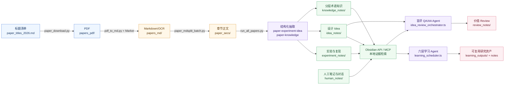

# 论文自动下载-结构化提取-聚焦主题评阅工作流

面向 AI Systems、LLM 推理、Serving、编译器、GPU Kernel 与体系结构研究的 Agent 原生论文工作台。

这个仓库不是“把一篇论文总结一下”的脚本集合，而是一条可复用的研究工作流：从标题下载论文，转换和拆分正文，抽取实验、Idea 与术语知识，再通过 Obsidian 本地知识库和伪代码式 Agent 编排，对指定主题做可追溯的学习与价值 Review。

## 1. 工作流贡献

传统论文阅读通常停在 PDF、零散摘要和一次性问答。`paper_analysis` 的目标是把论文加工成长期可用的研究资产，并让 Agent 能沿着清晰协议继续追问、复核和复用。


核心贡献有四点：

- **端到端资产化**：从论文标题到 PDF、Markdown、章节、实验笔记、Idea 笔记、知识笔记和 Review 结果，每一步都有可检查的 Markdown 产物。
- **本地知识优先**：`paper_secs`、`knowledge_notes`、`experiment_notes`、`idea_notes`、`human_notes` 和 `learning_outputs` 共同组成 Obsidian Vault 证据层，Agent 通过 Obsidian API 检索，而不是临时凭记忆回答。
- **分层研究视角**：围绕算法 Pipeline、Serving 调度、编译框架、Kernel 调度、硬件架构和芯片设计六层组织知识，适合跨论文比较系统方法。
- **伪代码式 Skill 协议**：复杂工作流不把 Skill 写成泛泛的长 Prompt，而写成可执行的研究伪代码：每个 `§` 任务块声明目标、线性步骤、证据约束、输出格式和下一跳；`scripts/` 只负责启动会话、转发 marker、记录 checkpoint 和恢复状态。

## 2. 能做什么



### 自动化下载和格式转换

- `scripts/paper_download.py` 按单个标题或标题文件下载公开可访问论文，输出 PDF 和 `results.json`。
- `scripts/pdf_to_md.py` 复用现有 Marker 环境，将单篇或批量 PDF 转为 Markdown，支持 `--force_ocr`、`--skip-existing` 和 Marker 参数透传。
- `scripts/paper_mdsplit_batch.py` 将 Marker Markdown 按一级标题拆成章节级 `paper_secs`，让后续 Agent 读取更稳定。

### 结构化抽取

- `scripts/run_all_papers.py` 顺序调用 Claude 侧 `paper-experiment-idea` 与 `paper-knowledge` skill。
- 抽取对象包括 Baseline 缺陷、核心设计、实现方式、实验配置、复现条件、pipeline/kernel 执行流和可迁移 Idea。
- 输出先进入 `repos/<batch>/{experiment_repo,idea_repo,knowledge_repo}`，再由 `scripts/repo_mdsplit_batch.py` 拆成独立 Obsidian 笔记。

### 基于 Obsidian 的本地分层知识库

- 本地证据源默认覆盖 `paper_secs`、`knowledge_notes`、`experiment_notes`、`idea_notes`、`human_notes` 和 `learning_outputs`。
- 分层知识按六个研究层次组织：算法 Pipeline、Serving 调度、编译框架、Kernel 调度、硬件架构、芯片设计。
- `obsidian-keyword-explain` 和 `obsidian-keyword-explainer` 通过 Obsidian API 搜索与读取笔记，适合解释术语、机制、公式、伪代码和执行时间线。

### 伪代码风格编排的问答 Agent 价值 Review

- `.claude/skills/` 的核心写法是“Prompt as executable pseudocode”：Skill 同时是研究方法说明、执行流程说明和协议说明。
- 每个 `§` block 都尽量写成明确的线性执行步骤，并在末尾说明控制流行为：继续追问、等待输入、输出结果、终止或交给下一个 Agent。
- `[LOOP: ...]`、`DONE`、`___AA_ANSWER_START___` 等 marker 只承载调度信号和分段边界；运行时状态、checkpoint、日志恢复和错误处理由脚本维护，避免让 Agent 每轮输出庞大的 JSON 状态。
- `scripts/learning_scheduler.ts` 将一个研究主题拆成六层问题空间、逐题回答、层内横向总结和跨层纵向总结。
- `scripts/idea_review_orchestrator.ts` 启动 Question Agent 与 Answer Agent 双会话：Question Agent 不读取 Idea 原文，只负责追问和评估；Answer Agent 读取 Idea note 与本地论文证据，给出可追溯回答。
- Review 流程使用显式 `§` 步骤与 `[LOOP: ...]` marker 控制，而不是把业务状态塞进笨重 JSON；最终结果写入 `review_notes/`，中间运行状态保存在 `.claude/idea-review-runs/`。

## 3. 构建需求与配置步骤

### 3.1 基础依赖

在 `/data3/paper_analysis` 根目录下工作：

```bash
cd /data3/paper_analysis
```

需要准备：

- Linux / Bash
- Python 3
- `mdsplit`
- Node.js、`npx`、`tsx`
- Claude Code CLI：脚本会调用 `claude`
- Codex：用于 `.codex/skills/` 下的交互式论文分析、术语解释和维护任务
- Obsidian：把当前仓库作为 Vault 打开
- Obsidian Local REST API 或等价 API 服务：用于给 `obsidian-mcp-server` 提供访问密钥
- 现有论文下载后端，默认 `/data3/agent_research/download_papers.py`
- 现有 Marker 环境，默认 `/home/descfly/Desktop/marker` 与 `/home/descfly/miniconda3/bin/python3`

快速检查：

```bash
python3 -m py_compile scripts/*.py
mdsplit --help
npx tsx --version
claude --version
npx tsx scripts/idea_review_orchestrator.test.ts
bash -n scripts/monitor_progress.sh
```

### 3.2 下载器与 Marker 路径

默认路径能用时不需要配置。迁移环境时用环境变量覆盖：

```bash
PAPER_DOWNLOAD_BACKEND=/path/to/download_papers.py \
  python3 scripts/paper_download.py --help

MARKER_ROOT=/path/to/marker \
MARKER_PYTHON=/path/to/python \
  python3 scripts/pdf_to_md.py --help
```

### 3.3 Obsidian API 和 MCP

Agent 的本地证据检索依赖 Obsidian API。推荐配置方式：

1. 用 Obsidian 打开 `/data3/paper_analysis` 作为 Vault。
2. 安装并启用 Local REST API 类插件，复制自己的 API key。
3. 确认本机能通过 Obsidian API 读取 Vault。
4. 在 `.mcp.json` 中配置 `obsidian-mcp-server`，把 `OBSIDIAN_API_KEY` 换成自己的 key。

示例结构：

```json
{
  "mcpServers": {
    "obsidian": {
      "type": "stdio",
      "command": "bunx",
      "args": ["obsidian-mcp-server@latest"],
      "env": {
        "MCP_TRANSPORT_TYPE": "stdio",
        "MCP_LOG_LEVEL": "info",
        "OBSIDIAN_API_KEY": "<your-obsidian-api-key>",
        "MCP_ENABLE_COMMANDS": "true",
        "OBSIDIAN_REQUEST_TIMEOUT_MS": "60000"
      }
    }
  }
}
```

注意：本地证据检索约定只通过 Obsidian API 完成。Web 搜索可以作为外部补充证据，但不能替代本地笔记检索。

### 3.4 Claude 和 Codex 入口

Claude 侧 skill 是批处理和复杂编排的主入口，callable 名称来自 `.claude/skills/*/SKILL.md` 的 frontmatter：

- 论文处理：`paper-experiment-idea`、`paper-knowledge`、`md-split`
- 六层学习：`learning-experiment-from-notes-question`、`learning-experiment-from-notes-answer`、`learning-experiment-from-notes-horizon`、`learning-experiment-from-notes-vertical`
- Idea 工作流：`idea-question`、`idea-answer`、`idea-brainstorm`
- 检索与归档：`obsidian-keyword-explain`、`export-conversation-notes`

Codex 侧 skill 更适合交互式研究维护：

- `paper-single-analysis`
- `paper-experiment-idea`
- `paper-knowledge-base`
- `obsidian-keyword-explainer`
- `export-conversation-notes`

## 4. 端到端使用步骤

### 4.1 下载论文

```bash
python3 scripts/paper_download.py \
  --file /data3/paper_analysis/papers_pdf/paper_titles_2026.md \
  --output /data3/paper_analysis/papers_pdf/paper_2026
```

先只检查标题解析：

```bash
python3 scripts/paper_download.py \
  --file /data3/paper_analysis/papers_pdf/paper_titles_2026.md \
  --output /data3/paper_analysis/papers_pdf/paper_2026 \
  --dry-run
```

### 4.2 PDF 转 Markdown

```bash
python3 scripts/pdf_to_md.py batch \
  /data3/paper_analysis/papers_pdf/paper_2026 \
  --output /data3/paper_analysis/papers_md/md_2026 \
  --workers 2 \
  --skip-existing
```

扫描版或文本质量较差的论文可加：

```bash
python3 scripts/pdf_to_md.py single \
  "/data3/paper_analysis/papers_pdf/paper_2026/<论文文件名>.pdf" \
  --output /data3/paper_analysis/papers_md/md_2026 \
  --force_ocr
```

### 4.3 拆分章节

```bash
python3 scripts/paper_mdsplit_batch.py \
  /data3/paper_analysis/papers_md/md_2026 \
  /data3/paper_analysis/paper_secs/secs_2026
```

### 4.4 结构化抽取论文资产

先 dry-run 验证路径和标题，不启动 Claude：

```bash
python3 scripts/run_all_papers.py \
  --paper-base-dir /data3/paper_analysis/paper_secs/secs_2026 \
  --checkpoint-dir /data3/paper_analysis/paper_extract_checkpoints/2026 \
  --output-repo-dir /data3/paper_analysis/repos/repo_2026 \
  --title "1-Towards High-Goodput LLM Serving with Prefill-decode Multiplexing" \
  --dry-run
```

确认无误后移除 `--dry-run`。批处理完成后拆分为 Obsidian 笔记：

```bash
python3 scripts/repo_mdsplit_batch.py \
  /data3/paper_analysis/repos/repo_2026 \
  --notes-base /data3/paper_analysis
```

### 4.5 启动六层研究学习

```bash
npx tsx scripts/learning_scheduler.ts \
  --work-dir /data3/paper_analysis/learning_outputs \
  --user-input "研究 MoE 在单 GPU 上的多算子并发，侧重 Kernel 调度"
```

监控进度：

```bash
watch -n 5 -c scripts/monitor_progress.sh <learning-run-directory>
```

### 4.6 启动指定主题或 Idea 的价值 Review

```bash
npx tsx scripts/idea_review_orchestrator.ts \
  --idea-note "/data3/paper_analysis/idea_notes/<Idea Note>.md" \
  --work-dir "/data3/paper_analysis/.claude/idea-review-runs/<short-name>" \
  --max-rounds 8 \
  --max-budget-usd 100
```

如果已有可恢复 checkpoint：

```bash
npx tsx scripts/idea_review_orchestrator.ts \
  --idea-note "/data3/paper_analysis/idea_notes/<Idea Note>.md" \
  --work-dir "/data3/paper_analysis/.claude/idea-review-runs/<short-name>" \
  --resume \
  --max-budget-usd 100
```

## 5. 目录结构

```text
paper_analysis/
├── papers_pdf/              # 下载的原始论文
├── papers_md/               # Marker 转换结果
├── paper_secs/              # 按章节拆分后的论文
├── repos/                   # Agent 生成的汇总 repo
├── knowledge_notes/         # 分层术语知识库
├── experiment_notes/        # 实验与复现信息
├── idea_notes/              # 论文设计 Idea
├── review_notes/            # Idea Review 结果
├── human_notes/             # 人工笔记与对话归档
├── learning_outputs/        # 多 Agent 学习结果
├── paper_extract_checkpoints/
├── .claude/skills/          # Claude 批处理与编排 skill
├── .codex/skills/           # Codex 交互式研究 skill
└── scripts/
```

## 6. 使用边界

- 论文下载需要网络，并受公开可访问来源限制。
- Marker OCR 和大批量转换可能需要较多 CPU/GPU、显存与时间。
- `run_all_papers.py`、`learning_scheduler.ts` 和 `idea_review_orchestrator.ts` 会启动 Agent，并可能产生模型调用费用。
- 批量分析前建议先用 `--dry-run`、临时目录和小批量标题文件验证路径。
- Agent 输出是研究辅助材料；关键论文结论、实验数字与复现配置仍需要人工核对。

更多脚本细节、正式路径约定和已验证样例见 [scripts/README.md](scripts/README.md)。
